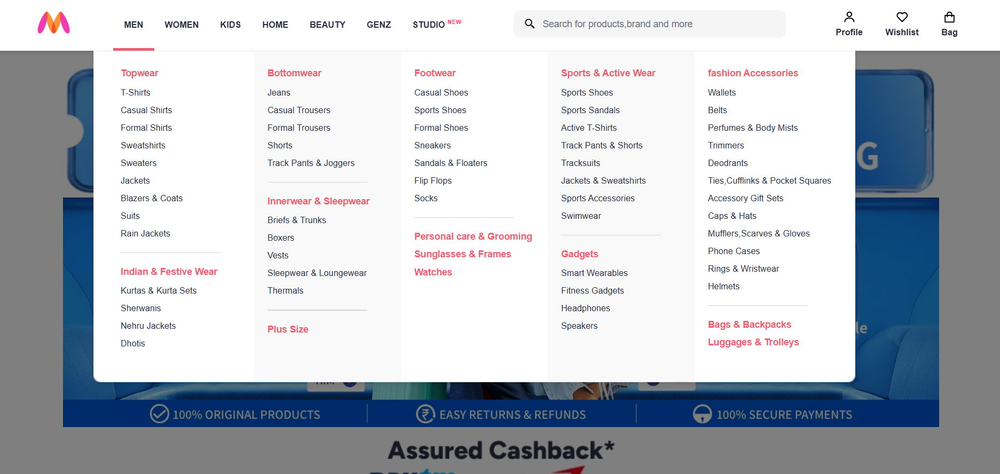

# Myntra Clone

A front-end clone of the popular e-commerce fashion website Myntra.


## Installation

1. Clone the repository:
   ```
   git clone https://github.com/CodemaxAI/Myntra-clone.git
   ```

2. Open the project folder:
   ```
   cd myntra-clone
   ```

3. Open `index.html` in your browser to view the website.


## Screenshots

### Homepage


### Dropdown


### User profile
